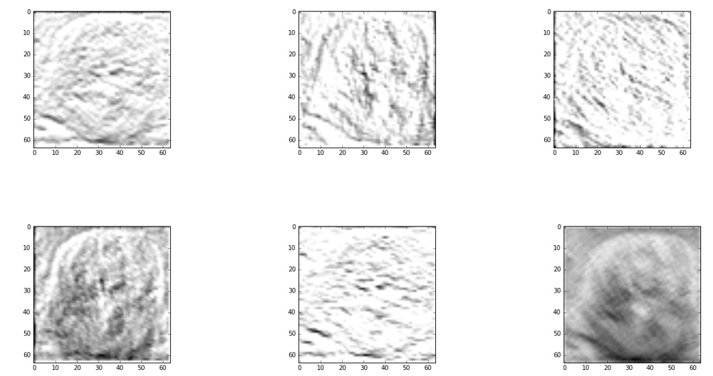
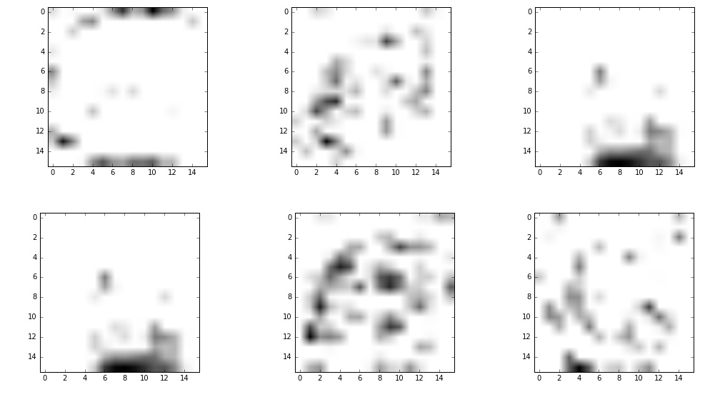
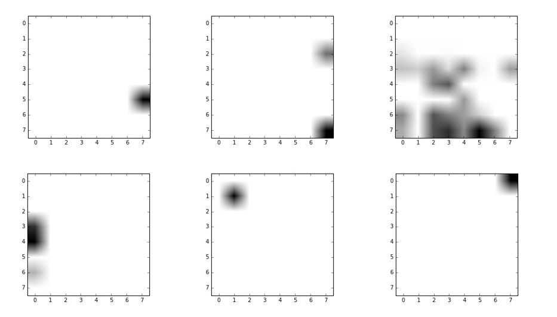

# thyroid
> this code is made for predicting thyroid cacner using ML , specifying CNNs 

> used CNNs in this code is composed to 5 convolution layers and 2 fully connected layer 

> each convolution layers has 500 nodes and and last convolution layer is flatted to use in fully connected layer

#data Set 
# normal : 

# malignant : 

data augmentation : No

ROI data : Yes 

#representative Image Convolution 1 

#representative Image Convolution 2

#representative Image Convolution 3

#ROC Graph 

