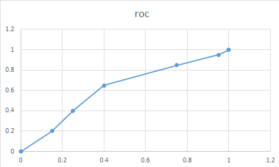

# thyroid
> this code is made for predicting thyroid cacner using ML , specifying CNNs 

> used CNNs in this code is composed to 5 convolution layers and 2 fully connected layer 

> each convolution layers has 500 nodes and and last convolution layer is flatted to use in fully connected layer

#data Set 

> benign : 252 

> malignant : 96

>train data : 282

>validation data : 250

#data reshpae 

>size 64 * 64

#data augmentation  

>Malignant : Yes ( up down left right side flip , 96 *3 )

>normal : No

#data processing
> ROI is extracted from original pic

#representative Image Convolution 1 

#representative Image Convolution 2

#representative Image Convolution 3

#ROC Graph 

